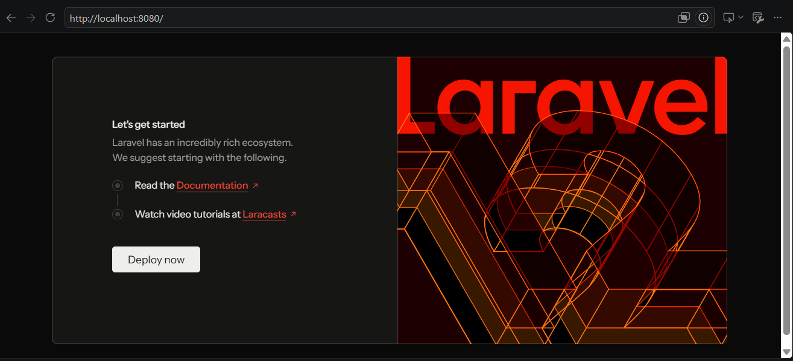
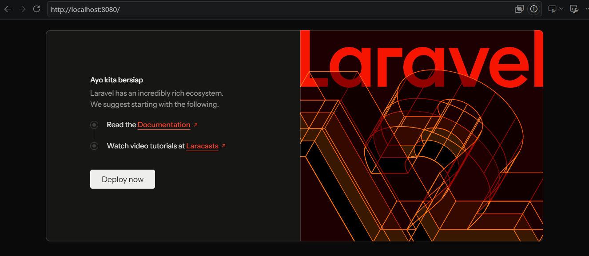

## 1.3 Read → Break → Fix → Build

### READ

1. Buka `public/index.php`. Baca dari atas ke bawah. Tulis dalam 3 kalimat apa yang dilakukan berkas ini.
2. Buka `bootstrap/app.php`. Identifikasi bagian mana yang mengurus route, mana yang mengurus middleware, mana yang mengurus exception.
3. Buka `routes/web.php`. Temukan route yang menghasilkan halaman selamat datang. Ubah teksnya, muat ulang browser, pastikan berubah.
4. Jalankan `php artisan route:list`. Cocokkan keluarannya dengan isi `routes/web.php`. 

### Jawaban 
1. `public/index.php` adalah pintu masuk utama yang menerima semua permintaan (request) dari browser untuk masuk ke aplikasi web. File ini menjalankan proses awal framework dengan memuat semua library (via autoload.php), mengecek mode pemeliharaan, dan menjalankan bootstrap aplikasi (via bootstrap/app.php).

2. 

- Routing
```php ->withRouting(
    web: __DIR__.'/../routes/web.php',
    commands: __DIR__.'/../routes/console.php',
    health: '/up',
) `` `

Bagian ini memberi tahu Laravel di mana mencari definisi route dan URL apa yang digunakan untuk health check.

web = Mengarah ke file routes/web.php yang berisi semua route untuk halaman website (diakses via browser).

commands = Mengarah ke routes/console.php untuk mendefinisikan perintah Artisan khusus.

health = Menentukan URL /up sebagai endpoint untuk mengecek status kesehatan aplikasi (biasanya digunakan oleh load balancer atau monitoring).

- middleware

```php 
->withMiddleware(function (Middleware $middleware): void {
    //
})
```
Saat ini masih kosong (belum ada konfigurasi tambahan).

Secara default, Laravel sudah memiliki middleware bawaan yang terdaftar di app/Http/Kernel.php.

Bagian ini berfungsi untuk:

    Mendaftarkan middleware global (berjalan di semua request)

    Mendaftarkan middleware grup (untuk grup route tertentu, seperti web atau api)

    Membuat alias middleware agar bisa dipanggil di route (misalnya auth, admin)

- Exception 
  
  ```php 
  ->withExceptions(function (Exceptions $exceptions): void {
    //
}) ```

Saat ini masih kosong (belum ada konfigurasi tambahan).

Secara default, Laravel sudah memiliki penanganan error bawaan.

Bagian ini berfungsi untuk:

    Mengkustomisasi halaman error (404, 403, 500, dll)

    Mengatur reporting error ke layanan seperti Sentry atau Bugsnag

    Menentukan bagaimana aplikasi merespons berbagai jenis exception

  - 

3. - sebelum diubah
    

   - setelah diubah
  

  4. 
   - GET|HEAD / = Route::get('/', ...) di baris 5
   - GET|HEAD tentang = Route::get('/tentang', ...) di baris 9