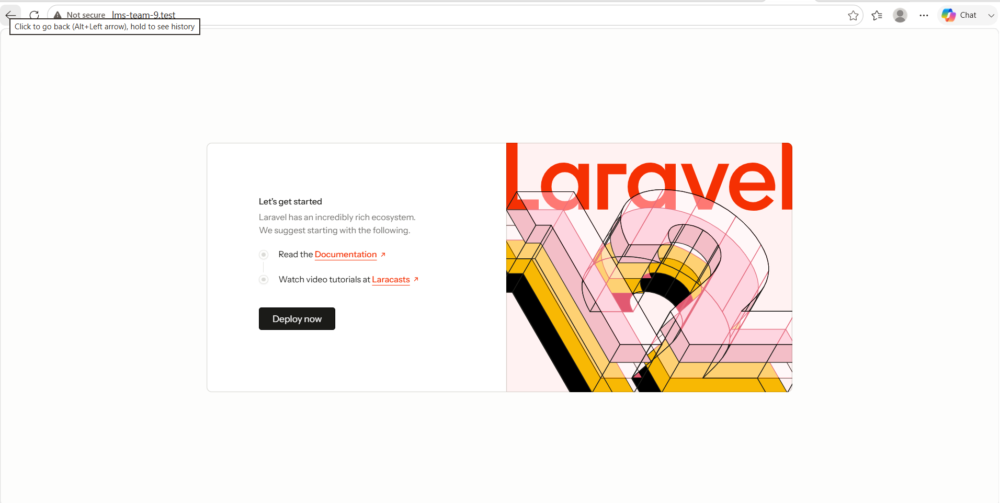
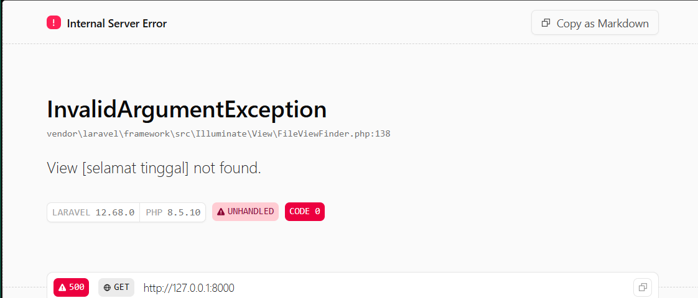

## 1.3 Read → Break → Fix → Build

### READ — Bedah instalasi Anda sendiri (45 menit)

Setelah instalasi selesai dan halaman selamat datang Laravel muncul, kerjakan **tanpa AI**:

1. Buka `public/index.php`. Baca dari atas ke bawah. Tulis dalam 3 kalimat apa yang dilakukan berkas ini.
2. Buka `bootstrap/app.php`. Identifikasi bagian mana yang mengurus route, mana yang mengurus middleware, mana yang mengurus exception.
3. Buka `routes/web.php`. Temukan route yang menghasilkan halaman selamat datang. Ubah teksnya, muat ulang browser, pastikan berubah.
4. Jalankan `php artisan route:list`. Cocokkan keluarannya dengan isi `routes/web.php`.

**jawab**
1. buka public/index.php yang dimana ini merupakan pintu masuk utama semua request. 
- pertama, cek maintenance mode
-kedua, autoload supaya php kenal semua class laravell (tanpa ini class dianggap tidak ada, atau dijalan secara manual)
-ketiga load bootstrap file ini me-return sebuah objek Application yang sudah lengkap terkonfigurasi (kerangkanya sudah jadi, tapi belum memproses request apapun).
- empat handlerequest tangkap data request dari browser,lalu proses: cocokkan ke route, lewat middleware, jalankan controller,hasilnya (HTML) dikirim balik ke browser.
2.- withRouting(.....) bagian route.isinya nunjuk ke file routes/web.php, routes/console.php, dan endpoint /up.
- withMiddleware(function (Middleware $middleware) {...}) → bagian middleware. Closure ini tempat daftar middleware global (defaultnya kosong).
- withExceptions(function (Exceptions $exceptions) {...}) → bagian exception. Closure ini tempat custom cara Laravel menangani error (defaultnya kosong juga).
3. 

4. hasil dari php artisan route:list yaitu menampilkan empat route yang aktif di aplikasi. - baris GET| HEAD/ merupakan pasangan dari Route::get('/', function() {...}) route yang ditulis manual terdaftar pada sistem. - lalu tiga baris (storage/{path} dua baris, dan up) tidak ditulis secara manual melainkan didaftarkan otomatis
- storage/{path} oleh package internal Laravel (FilesystemServiceProvider) untuk keperluan akses file upload, dan up oleh konfigurasi health: '/up' di bootstrap/app.php untuk keperluan health check server.